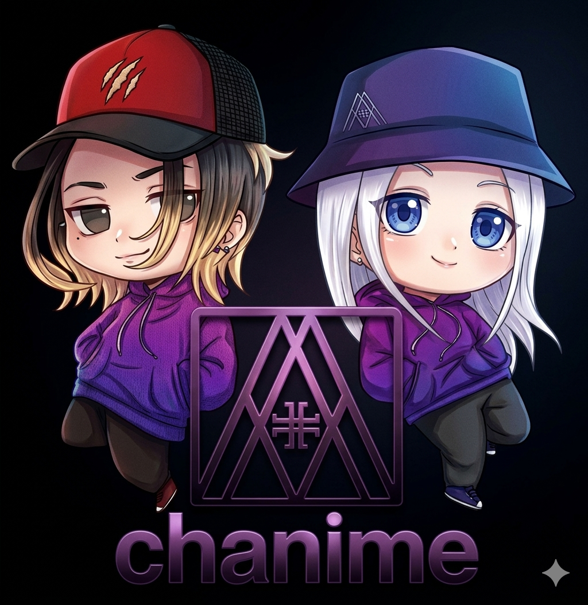

<div align="center">
  
  <h1>Chanime</h1>
  <p><strong>Your Ultimate Ad-Free Anime Streaming Experience</strong></p>
  
  <p>
    <a href="https://yume-animez.vercel.app/home"><strong>⛩️ Chanime</strong></a>
  </p>

  <p>
    <a href="#-key-features">Features</a> •
    <a href="#%EF%B8%8F-tech-stack">Tech Stack</a> •
    <a href="#-installation">Installation</a> •
    <a href="#-contributing">Contributing</a>
  </p>
</div>

---

## 📖 Introduction

**Chanime** is a highly polished, feature-rich anime streaming platform built for fans who want a seamless, ad-free viewing experience. It hooks into AniList and MyAnimeList and utilizes Miruro API to provide a comprehensive anime library wrapped in a gorgeous Glassmorphism user interface. 

Our focus is entirely on usability, speed, and cross-platform consistency.

## ✨ Key Features

- **🚫 Ad-Free Streaming**: Pure entertainment without popups, redirects, or visual clutter.
- **📺 High-Quality Playback**: Fast streaming with multiple server options, subtitle/audio toggles, and quality selectors natively baked into the player.
- **🔄 Two-Way Tracker Sync**: Link **AniList** and **MyAnimeList** accounts! The player will automatically update your viewing progress seamlessly in the background as you watch.
- **💬 Live Comments & Reactions**: Express yourself on episodes using the custom-built nested comment system with integrated GIF support. Drop quick "likes" or "dislikes" on comments and specific episodes.
- **⏯️ Smart Resume**: Intelligent tracking remembers exactly what episode you were on. "Watch Now" will instantly drop you back into the action.
- **🎨 Modern UI/UX**:
    - **Glassmorphism Design**: Sleek, immersive dark-themed presentation.
    - **Spotlight Carousel**: Discover tracking information, genres, ratings, and studios right from the top page.
    - **Cinema Mode**: Distraction-free, immersive video player layout.
    - **Fully Responsive**: A premium and consistent experience whether you are on Desktop, Tablet, or Mobile.
- **🔐 Secure Authentication**: Includes full user accounts, password recovery flow via email, Turnstile bot protection, and more.
- **🔎 Advanced Discoverability**: Deep search, category filtering, schedule countdowns, and genre exploration.

## 🛠️ Tech Stack

- **Backend**: Python (Flask, Async/Await)
- **Frontend**: HTML5, CSS3 (Vanilla / Custom Variables), JavaScript
- **Video Player**: Video.js with specialized integrations
- **Database**: MongoDB (User accounts, watch history, caching logic)
- **Data & Streaming APIs**: Miruro Native API, AniList GraphQL, MyAnimeList OAuth API
- **Security**: Cloudflare Turnstile, Bcrypt Password Hashing, Session Versioning

## 🚀 Installation & Local Development

Ready to run Chanime locally? Follow these steps:

1. **Clone the Repository**
    ```bash
    git clone https://github.com/OTAKUWeBer/Chanime
    cd Chanime
    ```

2. **Create a Virtual Environment**
    ```bash
    python -m venv venv
    # Windows
    venv\Scripts\activate
    # macOS/Linux
    source venv/bin/activate
    ```

3. **Install Dependencies**
    ```bash
    pip install -r requirements.txt
    ```

4. **Set Up Environment Variables**
    Duplicate `.env.example` and rename it to `.env`. Fill in the required parameters:
    ```env
    # Core Application Settings
    FLASK_KEY="YOUR_RANDOM_SECRET_KEY"
    ALLOWED_ORIGINS="http://localhost:5000"

    # Cloudflare Turnstile (for Login / Signup protection)
    CLOUDFLARE_SECRET="YOUR_CLOUDFLARE_SECRET"

    # Database
    MONGODB_URI="mongodb+srv://<username>:<password>@<cluster>.mongodb.net/...?"
    db="YumeDB"
    users_collection="users"
    watchlist_collection="watchlist"
    comments_collection="comments"
    episode_reactions_collection="episode_reactions"

    # Scraping / Streaming Endpoints
    MIRURO_API_URL="https://api.your-domain.com/"
    PROXY_URL="https://proxy.your-domain.com/proxy/"

    # Auth Integrations 
    # (Set up API clients via AniList & MAL developer portals respectively)
    ANILIST_CLIENT_ID="YOUR_ANILIST_CLIENT_ID"
    ANILIST_CLIENT_SECRET="YOUR_ANILIST_CLIENT_SECRET"
    ANILIST_REDIRECT_URI="http://localhost:5000/auth/anilist/callback"

    MAL_CLIENT_ID="YOUR_MAL_CLIENT_ID"
    MAL_CLIENT_SECRET="YOUR_MAL_CLIENT_SECRET"
    MAL_REDIRECT_URI="http://localhost:5000/auth/mal/callback"

    # SMTP Settings (for password resets)
    GMAIL_USER="your-email@gmail.com"
    GMAIL_APP_PASSWORD="your-16-char-app-password"
    ```

5. **Run the Application**
    ```bash
    python run.py
    ```
    Access the application right from your browser at `http://localhost:5000`.

## ⚙️ Integrations Setup Notes

- **Miruro API**: You'll need access to a Miruro-compatible data API instance for anime indexing and m3u8 stream resolution. 
- **AniList & MyAnimeList**: Go to their respective Developer Portals, create a new application, and match the OAuth Redirect URIs to your `.env` values.
- **Passwords via Gmail**: You'll need to generate a Google App Password for the application to dispatch secure password reset tokens.

## 🤝 Contributing

We welcome community contributions! Found a bug, or have a UI polish idea? Read our setup to dive in:

1. **Fork the Project**
2. Create your Feature Branch (`git checkout -b feature/CoolNewAddition`)
3. Commit your Changes (`git commit -m 'feat: Add a new custom player skin'`)
4. Push to the Branch (`git push origin feature/CoolNewAddition`)
5. Open a **Pull Request**

## 📜 License

This project is open-source and available under the [MIT License](LICENSE).

---

<div align="center">
  <p>Made with ❤️ for the Anime Community</p>
</div>
